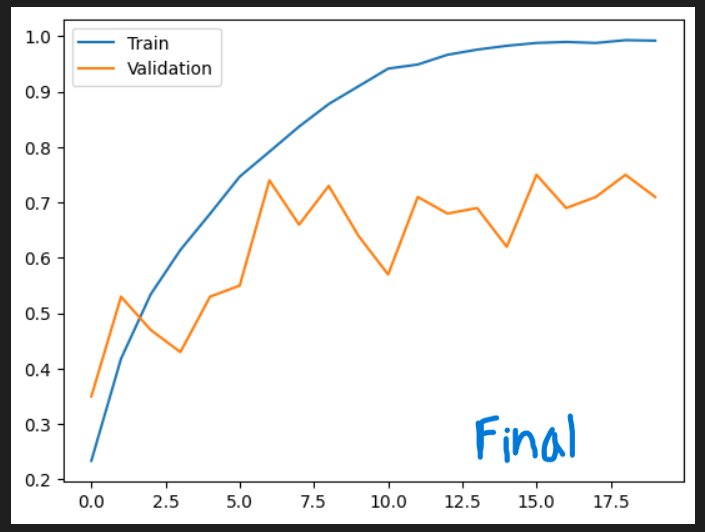
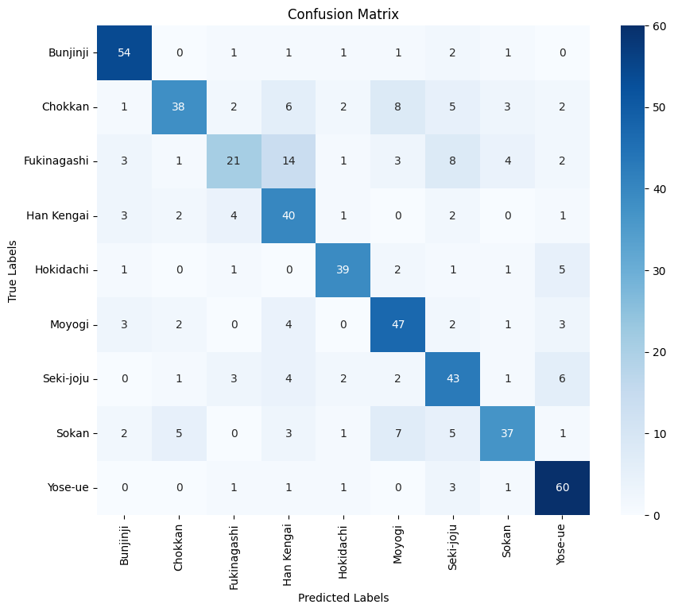

# Bonsai Classification Using CNNs

## Author
Isaiah Milkey

## Abstract

This project explores the use of Convolutional Neural Networks (CNNs) for classifying images of bonsai trees into nine distinct styles. The initial model was based on a handwritten digit classification notebook from course materials, but it performed poorly. Through iterative improvements—such as experimenting with different optimizers (SGD, RMSProp, Adam), adding batch normalization, and adjusting dropout layers—the final model achieved a validation accuracy of 0.75 and a training accuracy of 0.9931. The Adam optimizer was chosen for its superior performance, and the final architecture uses three convolutional layers with batch normalization and a single dropout layer.

## Introduction

Choosing a dataset for this project was a challenge, but ultimately, I decided to work with a relaxing and visually interesting dataset: bonsai tree images. This project builds on previous work with simpler image classification tasks, expanding to multi-class labeling with higher-resolution images (224x224 pixels) and more complex classes. The notebook documents the iterations and thought process behind finding the best model configuration.

## Dataset

- **Source:** [Kaggle - Bonsai Styles Images](https://www.kaggle.com/datasets/vincenzors8/bonsai-styles-images/data)
- **Description:** 2,700 images of bonsai trees, divided into 9 classes by style.
- **Preparation:** Images are organized in folders by class. A dictionary is created to map image paths to their labels. Data augmentation techniques such as random horizontal flip, zoom, and color jitter are applied to reduce overfitting.

## Methods

- **Framework:** PyTorch
- **Preprocessing:** Images are resized to 224x224 and converted to tensors. Labels are encoded as integers.
- **Data Augmentation:** Random horizontal flip, rotation, and color jitter.
- **Model Architecture:** 
  - Three convolutional layers with increasing filter sizes.
  - Batch normalization after each convolutional layer.
  - Max pooling and a single dropout layer after the first convolution.
  - Two fully connected layers for classification.
- **Training:** 
  - Optimizer: Adam (lr=0.001, weight_decay=1e-3)
  - Loss Function: CrossEntropyLoss
  - Training and validation split: 80/20

## Results and Discussion

- **Training Accuracy:** 0.9931
- **Validation Accuracy:** 0.75
- **Observations:** 
  - Adam optimizer outperformed others.
  - Overfitting was mitigated by using a single dropout layer and data augmentation.
  - Batch normalization improved both training speed and accuracy.
  - Too many dropout layers led to excessive loss of information.

## Conclusions

This project reinforced the importance of high-quality data in training effective CNNs. While CNNs can perform well on standard datasets, real-world data often requires careful preprocessing and augmentation. Understanding the function of each layer in the network was crucial for diagnosing and addressing overfitting. Future work could focus on further optimizing the model, improving overfitting detection, and expanding the dataset for better generalization.

## References

- nb8_CNN.ipynb (Handwritten Digit Classification from Canvas)
- [Bonsai Tree Dataset](https://www.kaggle.com/datasets/vincenzors8/bonsai-styles-images/data)
- [Image Classification with scikit-learn](https://kapernikov.com/tutorial-image-classification-with-scikit-learn/)
- [Visualizing CNNs](https://youtu.be/pj9-rr1wDhM?feature=shared)
- [CNN Layer Types](https://pyimagesearch.com/2021/05/14/convolutional-neural-networks-cnns-and-layer-types/)

## Code Appendix

All code for this project is available in the notebook and can be run as provided. See the notebook for detailed implementation and results.

---

*For questions or suggestions, please open an issue or submit a
